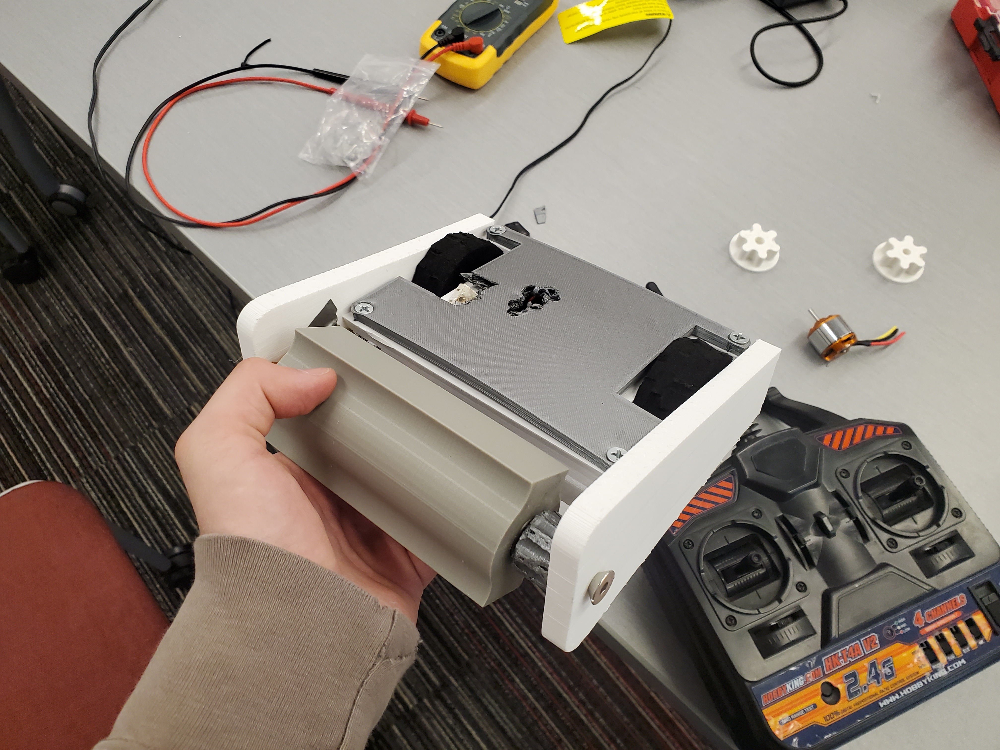
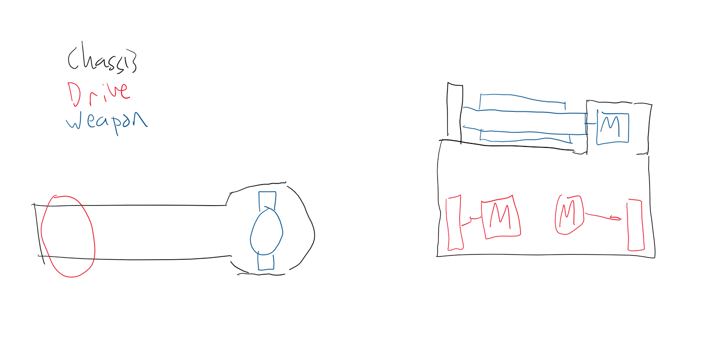
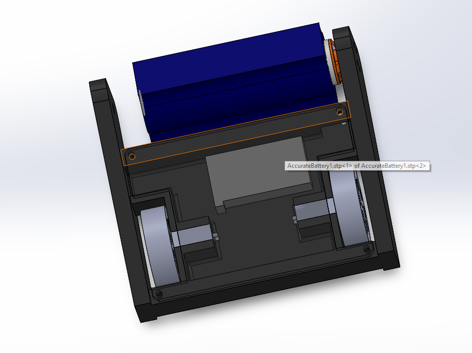
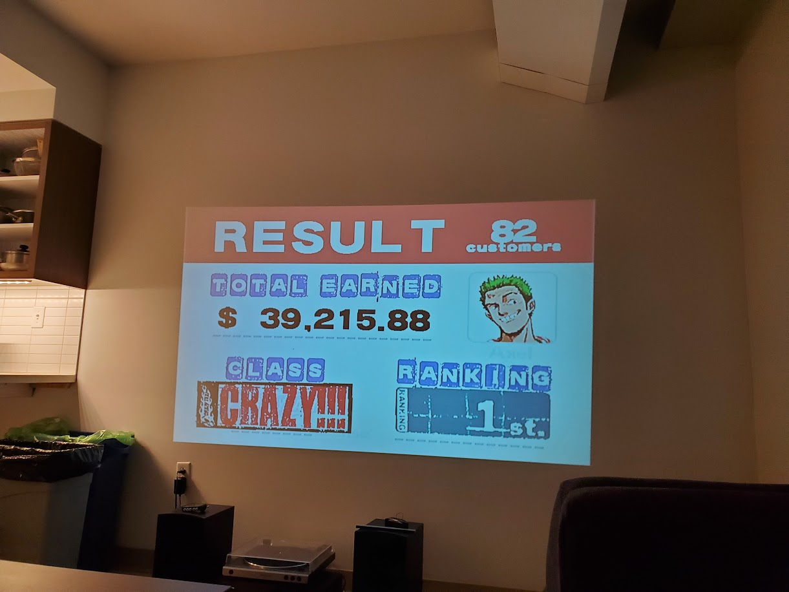
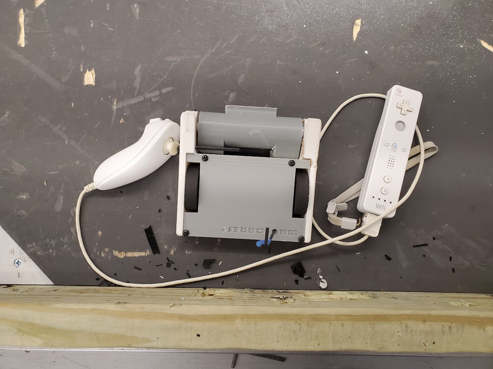
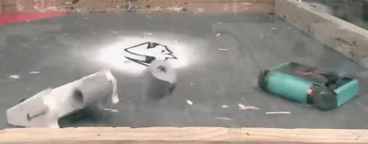
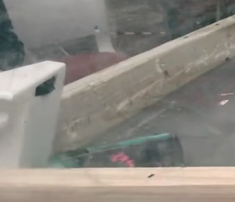
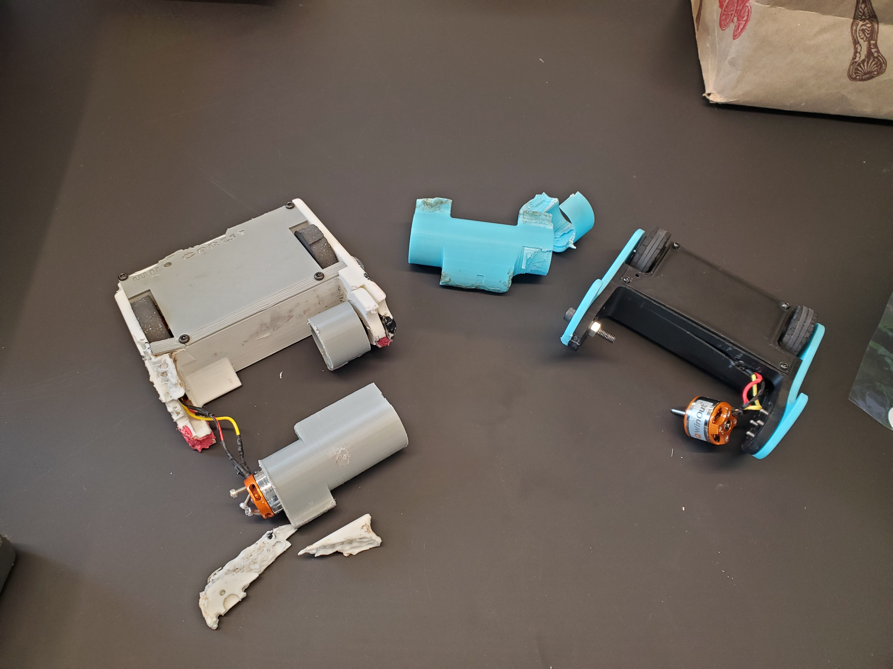
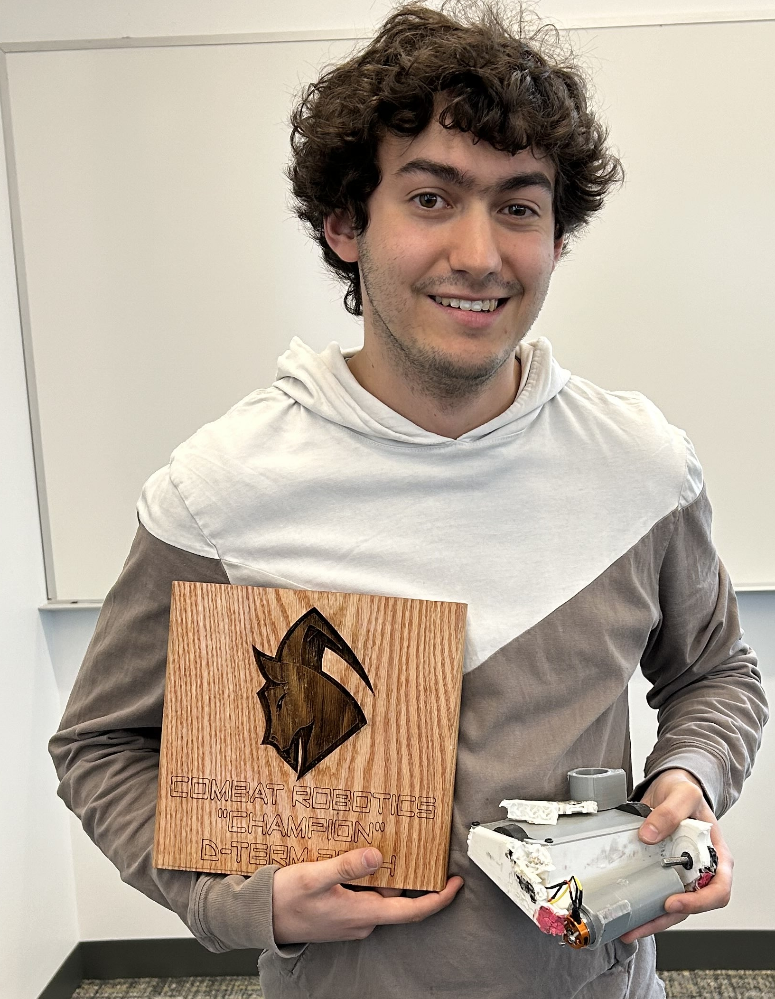

[written 5 jul 2025]

Ah yes the gateway to combat robotics: the plastic antweight, often abbreviated as "PLAnt." After being inspired by watching my friends at NHRL, I built a few PLAnts, and they were decently successful. I also made a YouTube video on them, and it somewhat caught on in the algorithm for some reason.



## The gist

You ever see the TV show [BattleBots?](https://battlebots.fandom.com/wiki/BattleBots) Basically that. The robots on the show are 250lbs and ridiculously expensive and difficult to build, but robot combat has a ton of smaller weight classes, particularly from recent advances in RC drones and lithium batteries that allow for super power dense. One of the smallest weight classes is the "plastic antweight," which is designed to be affordable and accessibile. For those who are not familiar, here's a quick summary of the rules...

* You have 3min to destroy your opponent's robot
	- 10s of no movement = KO
	- In many competitions, exposed battery = KO for safety reasons
	- You may tap out if you desire
	- Competitors are judged on damage, control, aggression
	- You are allowed one unstick (give robot a nudge out of an awkward position)
* Robot weight limit of 1lb
	- 50% weight bonus for "non-traditional movement" (i.e. anything that isn't wheels or treads)
* Robot must be made of 3D printed plastic parts
	- Only basic filaments are allowed (PLA, PETG, ABS, ASA)
	- No specialty filaments (TPU, nylon, CF/GF reinforced filaments, etc)
	- Exceptions for fasteners, motors, and electronics
* Robots must have an "active weapon"
	- spinner, lifter, crusher, etc.
* Be safe, don't be dangerous
	- Radio fail-safe for drive and weapon
	- Weapon lock
	- Exposed power cutoff
	- No deliberate entanglement
	- Some banned weapons (flame/heat/explosions, EMPs, liquids, etc.)

## My first attempt

Let's paint a scenario - it's a thursday in April 2023, and I just submitted the report for my [Laser Fault Injection MQP](../lfi_mqp/index.qmd). The WPI combat robotics club is hosting a PLAnt competition on Sunday - I should give it a try! So I download SolidWorks, and I can lear CAD, design a PLAnt, print it, and build it in 2 days right?

I had a simple idea of what I want. Vertical spinner, and completely invertible. Essentially everyone talks about how to flip yourself back over, but it's not as common to eliminate the concept of upside down. I made some idea drawings, and a friend of mine showed me the ropes of SolidWorks.

For drive, the robot used N20 brushed gearmotors to move it with foam wheels, driven by VEX MC20 speed controllers, and weapon was an Amazon special A2312 drone motor pressed into a wide drum, driven by some mystery BLHeli ESC, both of which were from my friends' wares but functionally identical to the ones the club lends out. All this was powered by a 3s 450mAh LiPo battery that the club lends out to people for these competitions. For controls, I wanted to use a Wii remote because I didn't have the typical RC transmitter and reciever people use but I did have a Wii remote and an ESP32 dev board.

I'll spare the details, but it was a long grind to design and build it. Poor scaling, frantic downsizing, BSODs, some design tweaks cut short by a corrupted file, an innefective wheel that became an effective spacer for that mysterious void in the CAD, and then I paid the ultimate price. While trying to reprogram the ESP32 at 3am the night before, I accidentally shorted the 11.2V LiPo battery to my computer's 5V USB rail. *Pop!* My laptop is dead. Devistated, I take a minute to decide what to do over a game of Crazy Taxi (not to brag but I'm like really good at Crazy Taxi. Below is my high score, and no it is not from that night).

Ultimately my friends convinced me to shove one of their recievers into the robot and get it running, and I succeeded. Back to the grind I go, and I was stressed. So much so, that when I was asked to name my robot, I gave the knee jerk response of "Who Cares?" And so, it stuck.

I had one fight against what was essentially the predecessor to [the 3lb robot Rhino](https://wiki.nhrl.io/wiki/index.php?title=Rhino), and I KO'd them by taking out their wheel. Then I proceeded to drive into the wall and crack my chassis.

<iframe width="560" height="315" src="https://www.youtube.com/embed/TDUJaJ4nNgw?si=tegbiVfS-OIbUurx&amp;start=17310" title="YouTube video player" frameborder="0" allow="accelerometer; autoplay; clipboard-write; encrypted-media; gyroscope; picture-in-picture; web-share" referrerpolicy="strict-origin-when-cross-origin" allowfullscreen></iframe>

The bot survived and was fixable, though I had a dead computer to deal with. My SSD was fine, though everything else wasn't, and I needed to get a new laptop.

## Who cares? Version 2

As hectic of an experience that was, I was hooked and hungry for more, though with a bit less of a time crunch. For the competitions in the next school year, I decided to work through the summer on a V2 PLAnt. Some of the highlights include...

* Designed the chassis to be printed with more walls, so it could take more hits.
* The weapon had an actual rake angle to bite onto opponents (the weapon only spun one way, however)
* A proper hole in the power switch, so I don't have to go at the top plate with pliers to make one.
* it said "who cares?" on the top plate, and the "o" was the switch hole!
* I got the Wii remote control scheme to work this time
* Added a 5V regulator to power the ESP32, protecting my USB port from the battery

However, one thing I did not address was the flat sides, which would lead to the robot being stuck on its side. Surely that won't happen right?

In the inaugural competition in December 2023, the robot did quite well, getting pieces of the chassis chipped off, but plastic-welded with back on with a soldering iron. I made it to the semifinals, only to lose to a power issue that I talk about more in depth in my page on the [Wii remote control scheme](../wiimote_elrs/index.qmd). Unsatisfied, I asked the winner of the tournament, who beat the robot I lost to, for a grudge match to give me the ending I was hoping for. He agreed, and the results did not disappoint.

 

In January 2024 I entered their next competition with the same chassis and a spare weapon, where I beat the power issues for one fight, only to then forfeit after they return again worse than ever after swapping a drive motor.

Then in April 2024, a week after competing with [my Beetleweight](../beetleweight/index.qmd) for the first time, I shoved my receiver into my beat up PLAnt and entered into their last one for the school year. I would ultimately make it to the end and win in one of the craziest PLAnt fights they've seen, and one of the most difficult judges' decision they've had to make at one of these competitions. We both lost our weapons and it ended in a pushing match, one that I managed to outmaneuver my opponent in.

All in all, the robot has had 11 total fights and an 8-3 record, all with that same chassis. All 11 fights were with the same chassis, which is frankly absurd given all the abuse it's taken. If it does return, I want to make sure that I do not have to print a second chassis

### Some highlighted Fights...

 
#### I keep flipping them upside down

<iframe width="560" height="315" src="https://www.youtube.com/embed/1sX9EwlLWOc?si=KbiANXYB8TdkZwLo&amp;start=15620" title="YouTube video player" frameborder="0" allow="accelerometer; autoplay; clipboard-write; encrypted-media; gyroscope; picture-in-picture; web-share" referrerpolicy="strict-origin-when-cross-origin" allowfullscreen></iframe>

#### Tanking hits and going for the KO

<iframe width="560" height="315" src="https://www.youtube.com/embed/1sX9EwlLWOc?si=KbiANXYB8TdkZwLo&amp;start=22688" title="YouTube video player" frameborder="0" allow="accelerometer; autoplay; clipboard-write; encrypted-media; gyroscope; picture-in-picture; web-share" referrerpolicy="strict-origin-when-cross-origin" allowfullscreen></iframe>

#### Losing to a power issue in semifinals

<iframe width="560" height="315" src="https://www.youtube.com/embed/1sX9EwlLWOc?si=KbiANXYB8TdkZwLo&amp;start=24835" title="YouTube video player" frameborder="0" allow="accelerometer; autoplay; clipboard-write; encrypted-media; gyroscope; picture-in-picture; web-share" referrerpolicy="strict-origin-when-cross-origin" allowfullscreen></iframe>

#### Unsatisfied, I get the glorious end I hoped for in a grudge match against the December champion

<iframe width="560" height="315" src="https://www.youtube.com/embed/1sX9EwlLWOc?si=KbiANXYB8TdkZwLo&amp;start=27555" title="YouTube video player" frameborder="0" allow="accelerometer; autoplay; clipboard-write; encrypted-media; gyroscope; picture-in-picture; web-share" referrerpolicy="strict-origin-when-cross-origin" allowfullscreen></iframe>

#### I welded that piece back on

<iframe width="560" height="315" src="https://www.youtube.com/embed/P4epaQHwq0E?si=sP_iLlrW4GOEAb9M&amp;start=9490" title="YouTube video player" frameborder="0" allow="accelerometer; autoplay; clipboard-write; encrypted-media; gyroscope; picture-in-picture; web-share" referrerpolicy="strict-origin-when-cross-origin" allowfullscreen></iframe>

#### Please don't die please don't die please don't die please don't die

<iframe width="560" height="315" src="https://www.youtube.com/embed/59zge9_FaKE?si=97tgyQypqkla6pL5&amp;start=9314" title="YouTube video player" frameborder="0" allow="accelerometer; autoplay; clipboard-write; encrypted-media; gyroscope; picture-in-picture; web-share" referrerpolicy="strict-origin-when-cross-origin" allowfullscreen></iframe>

#### We meet again in the semifinals

<iframe width="560" height="315" src="https://www.youtube.com/embed/59zge9_FaKE?si=0KOTjDeUjAM-bze4&amp;start=22484" title="YouTube video player" frameborder="0" allow="accelerometer; autoplay; clipboard-write; encrypted-media; gyroscope; picture-in-picture; web-share" referrerpolicy="strict-origin-when-cross-origin" allowfullscreen></iframe>

#### The epic final, with the toughest judges' decision they've seen yet

<iframe width="560" height="315" src="https://www.youtube.com/embed/59zge9_FaKE?si=8QKLCooGmnBSDROB&amp;start=24726" title="YouTube video player" frameborder="0" allow="accelerometer; autoplay; clipboard-write; encrypted-media; gyroscope; picture-in-picture; web-share" referrerpolicy="strict-origin-when-cross-origin" allowfullscreen></iframe>